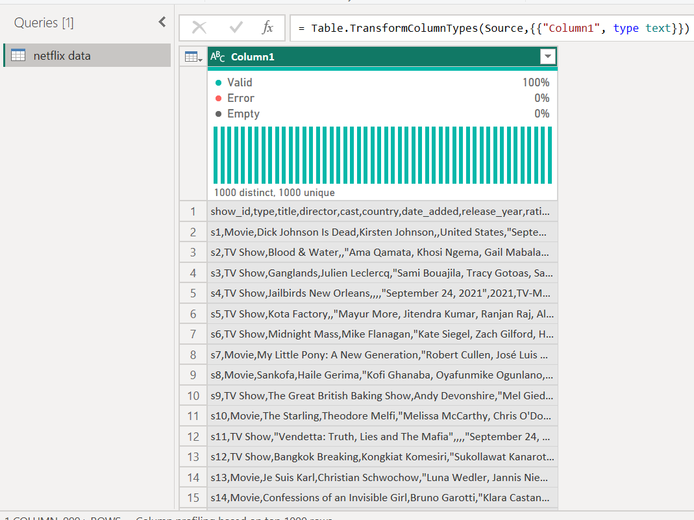
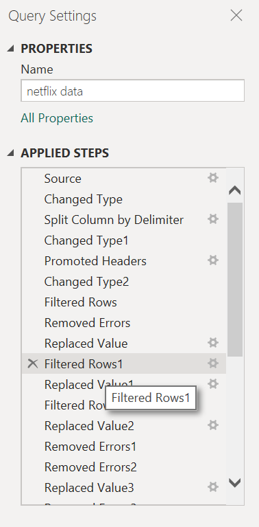
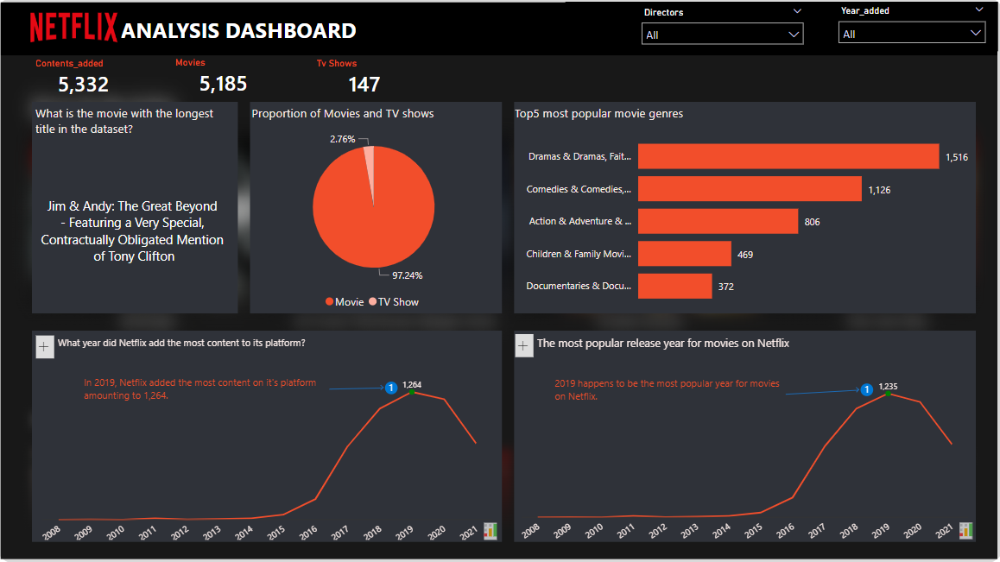

## 📊🎬 Netflix Movie Analysis (2008-2021) 🎥📈

---

## Introduction
Netflix is an American subscription video on-demand over-the-top streaming service owned and operated by Netflix, Inc.

## Problem Statement
This repository will contain projects and analysis of **Data In Moion Challenges**
1. Is there any missing data? Deal with them accordingly.
2. Using the ‘date_added’ column, a new column called ‘year_added’ only has the year the title was added.
3. Using the ‘date_added’ column, create a new column called ‘month_added’ that only has the month the title was added.
4. Check the data types. Does anything look odd? Adjust accordingly.
5. What is the most popular release year for movies on Netflix?
6. In what year did Netflix add the most content to its platform?
7. What is the movie with the longest title in the dataset?
8. What are the top 5 most popular movie genres?
9. Create a pie chart visualizing the proportion of movies vs TV shows. Label each section with the percentage.
10. Create a dashboard to summarize your insights.

## Data Sourcing
The data was sourced directly from the web, **click [here](https://raw.githubusercontent.com/kedeisha1/Challenges/main/netflix_titles.csv) to download**

## Data Transformation
The dataset imported from the web obviously needs to be cleaned and transformed. Check out a **[video](https://www.youtube.com/watch?v=sHbrShGN6VE&t=8s)** I created where I carried out this transformation using the power query feature of power Bi.
[See screenshot below after transformation]

 The Transformed data | Applied Steps
:--------------------:|:------------------------:
    | 

## Data Visualization

Dashboard

**click [here](https://tinyurl.com/2yntyje7) to interact with my report on powerBi Service.**
