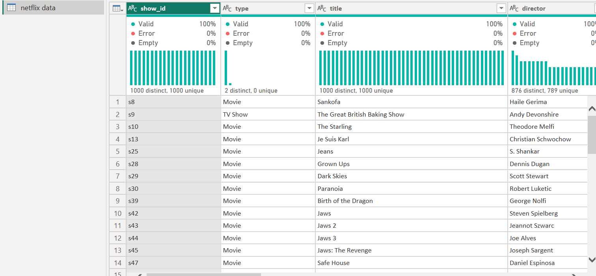

## 📊🎬 Netflix Movie Analysis (2008-2021) 🎥📈

---

## Introduction
Netflix is an American subscription video on-demand over-the-top streaming service owned and operated by Netflix, Inc.

## Problem Statement
This repository will contain projects and analysis of **Data In Moion Challenges**
1. Is there any missing data? Deal with them accordingly.
2. Using the ‘date_added’ column, a new column called ‘year_added’ only has the year the title was added.
3. Using the ‘date_added’ column, create a new column called ‘month_added’ that only has the month the title was added.
4. Check the data types. Does anything look odd? Adjust accordingly.
5. What is the most popular release year for movies on Netflix?
6. In what year did Netflix add the most content to its platform?
7. What is the movie with the longest title in the dataset?
8. What are the top 5 most popular movie genres?
9. Create a pie chart visualizing the proportion of movies vs TV shows. Label each section with the percentage.
10. Create a dashboard to summarize your insights.

## Data Sourcing
The data was sourced directly from the web, **click [here](https://raw.githubusercontent.com/kedeisha1/Challenges/main/netflix_titles.csv) to download**

## Data Transformation
The dataset imported from the web obviously needs to be cleaned and transformed. Check out a **[video](https://www.youtube.com/watch?v=sHbrShGN6VE&t=8s)** I created where I carried out this transformation using the power query feature of power Bi.

[See screenshot below after transformation]

 The Transformed data | Applied Steps
:--------------------:|:------------------------:
    | 

## Data Modelling
Here I created a calendar Table and used it to establish a relationship between both Tables.
Netflix_data Table
The Netflix_data Table| Calendar Table
:--------------------:|:------------------------:
 | 

**Find the modelled table below.** 

## Data Visualization

Dashboard

## Insights/Recommendations

**Insight:**

Based on the analysis of the Netflix dataset from 2008 to 2021, several key insights have been uncovered. Firstly, 2019 stood out as the year with the highest number of content additions, indicating a significant expansion of the platform. Additionally, 2019 was the most popular year for movies on Netflix, showcasing a diverse range of cinematic experiences. The top five movie genres on the platform were identified as dramas, comedies, action & adventure, children & family, and documentaries. Furthermore, the documentary "Jim & Andy" emerged as the movie with the longest title. Lastly, movies dominated the content on Netflix, accounting for 97.24%, while TV shows made up the remaining 2.76%.

**Recommendation:**
- Balance Between Movies and TV Shows: Despite the fact that Netflix is dominated by movies, it is still important to have a balanced collection of TV shows. Continuously curating a diverse range of high-quality TV shows will attract subscribers who prefer episodic storytelling and streaming experiences.
- Diverse Content Strategy: Given the popularity of dramas, comedies, action & adventure, kids & family, and documentaries, Netflix should continue investing in a wide variety of content in these genres. This will enable them to better serve their subscribers' diverse interests and preferences.
- Focus on Yearly Expansion: Building on the success of 2019 as the year of content, Netflix should continue prioritizing regular and substantial additions to their library each year. This will enhance subscriber engagement and satisfaction, providing them with a vast array of options.

**By leveraging data-driven insights, Netflix can continue providing captivating and relevant content to their subscribers while staying ahead in the competitive streaming industry.**

**click [here](https://tinyurl.com/2yntyje7) to interact with my report on powerBi Service.**
